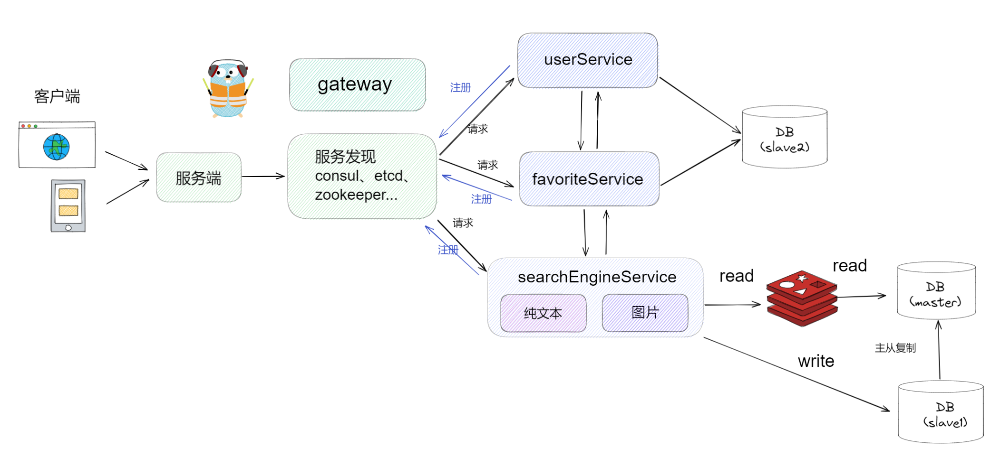

# Go-SearchEngine 重构中...

基于Go语言的搜索引擎

# 项目大体框架



1、gin作为http框架，grpc作为rpc框架，etcd作为服务发现。\
2、总体服务分成`用户模块`、`收藏夹模块`、`搜索引擎模块`。\
3、用户模块和收藏夹模块使用共同的数据库。\
4、搜索引擎单独设立数据库，并且预留了一个redis作为缓存，存储搜索引擎数据采用读写分离模式，主要负责读，次要负责写，允许主从复制的延迟。

# 项目主要功能
## 1. 用户模块
- 登录注册

## 2. 收藏夹模块
- 创建/更新/删除/展示 收藏夹
- 将搜索结果的url进行收藏夹的创建/删除/展示

# 项目主要依赖
- gin
- gorm
- etcd
- grpc
- jwt-go
- logrus
- viper
- protobuf

# 项目结构

## 1.grpc_todolist 项目总体
```
grpc-todolist/
├── app                   // 各个微服务
│   ├── favorite          // 收藏夹
│   ├── gateway           // 网关
│   ├── search-engine     // 新版搜索微服务
│   ├── search-engine-old // 旧版搜索微服务
│   └── user              // 用户模块微服务
├── bin                   // 编译后的二进制文件模块
├── config                // 配置文件
├── consts                // 定义的常量
├── doc                   // 接口文档
├── idl                   // protoc文件
│   └── pb                // 放置生成的pb文件
├── loading               // 全局的loading，各个微服务都可以使用的工具
├── logs                  // 放置打印日志模块
├── pkg                   // 各种包
│   ├── ctl               // 用户信息相关
│   ├── discovery         // etcd服务注册、keep-alive、获取服务信息等等
│   ├── es                // es 模块
│   ├── jwt               // jwt鉴权
│   ├── logger            // 日志
│   ├── res               // 统一response接口返回
│   ├── util              // 各种工具、处理时间、处理字符串等等..
│   └── wrappers          // 熔断
└── types                 // 定义各种结构体
```

## 2.gateway 网关部分
```
gateway/
├── cmd                   // 启动入口
├── internal              // 业务逻辑（不对外暴露）
│   ├── handler           // 视图层
│   └── service           // 服务层
│       └── pb            // 放置生成的pb文件
├── logs                  // 放置打印日志模块
├── middleware            // 中间件
├── routes                // http 路由模块
└── rpc                   // rpc 调用
```

## 3.user && favorite 用户与收藏夹模块
```
user/
├── cmd                   // 启动入口
└──internal               // 业务逻辑（不对外暴露）
   ├── service            // 业务服务
   └── repository         // 持久层
       └── db             // 视图层
           ├── dao        // 对数据库进行操作
           └── model      // 定义数据库的模型
```

## 4.search-engine 搜索引擎模块
重构中...


# 项目文件配置

各模块下的`config/config.yml`文件
```yaml
server:
  port: :4000
  version: 1.0
  jwtSecret: 38324-search-engine

mysql:
  driverName: mysql
  host: 127.0.0.1
  port: 3306
  database: search_engine
  username: search_engine
  password: search_engine
  charset: utf8mb4

redis:
  user_name: default
  address: 127.0.0.1:6379
  password:

etcd:
  address: 127.0.0.1:2379

services:
  gateway:
    name: gateway
    loadBalance: true
    addr:
      - 127.0.0.1:10001 

  user:
    name: user
    loadBalance: false
    addr:
      - 127.0.0.1:10002 # 监听地址

  favorite:
    name: favorite
    loadBalance: false
    addr:
      - 127.0.0.1:10003 # 监听地址

  searchEngine:
    name: favorite
    loadBalance: false
    addr:
      - 127.0.0.1:10004 # 监听地址

domain:
  user:
    name: user
  favorite:
    name: favorite
  searchEngine:
    name: searchEngine
```

# 导入接口文档

打开postman，点击导入


选择导入文件


效果


# 项目启动
- 在各模块下进行

```go
go mod tidy
```

- 在各模块下的cmd目录

```go
go run main.go
```